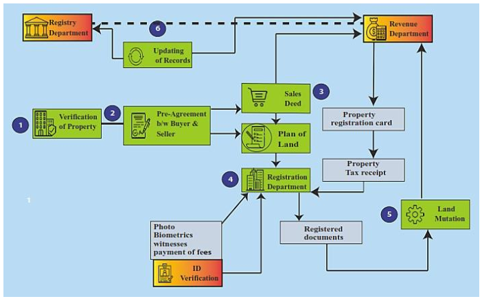
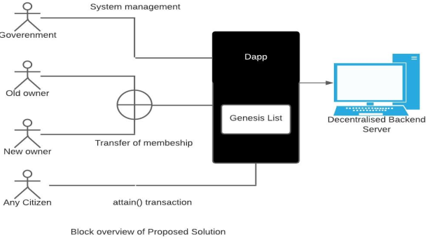
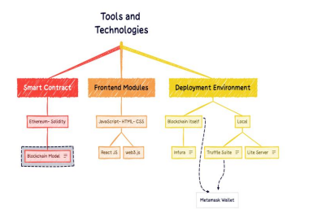
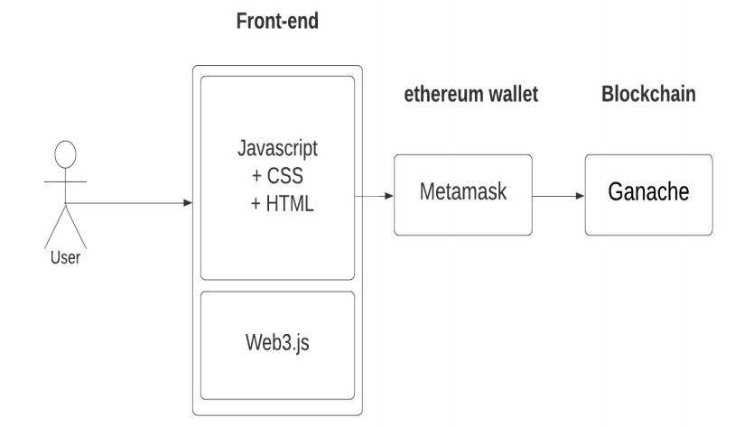

_A BLOCKCHAIN-BASED LAND REGISTRY SYSTEM_

Since from time immemorial, the problems of land have persisted in Cameroon, Africa and the world at large. some of these problems have resulted in wars leading to the lost of lives. The issue has always been that people argue on who has what piece of land with people selling their land to more than one person and others selling land that doesn’t belong to them. Even when the land titles papers were brought the problem still persisted because people could still create fakes and then we are right back to where we started. I take an example of a case beside me where someone is building a fence on the road. It may not be known how the land was Partitioned when the people were selling but one thing is for sure they have sown into the road and there is no evidence to show that the fence is on the road or that part of the land was separated as a road so we are forced to accept it. 

LAND REGISTRY SYSTEM
The Fundamentals of a land registry system can be mainly into four sections:
a. Unique identification: The main aim of the land registry system is to identify the right/ genuine owner of
the land and then finally submit the documents for registration. Currently, the user identification process
is not readily available and standardized. The existing blockchain technology built in a fashion that does
not require to disclose the identity of the user [6].
b. Initial transition process: Blockchain is and the mechanism that can be used to validate and store all
the land-related transitions and it can be further used to transfer the land ownership records [6].
Before applying the blockchain technology for land transition, the existing land title records to be
registered in the blockchain that is referred as the genesis block. All the parties involved in the system
must agree to it before proceeding further on [6].
c. Consent Principle: The permission of the real owner as per the land record is necessary to transfer
the land to the buyer. The main issues identified during this process are:
 Identification of the genuine owner.
 Availability of digital signatures to all the users/ owners.
 The mechanism or the middle man to verify the coercion/transfer under threat without free will.
In the blockchain, the idea is to remove any middle man but in this case coercion cannot be checked [6].
d. Publicity of records/ownership databases: The main idea is to make record easily accessible and trusted
that could be either publically available for inspection or any trusted third party that can cater the needs of
a probable purchaser [6].
The present paper-based traditional land registry system has been presented in Figure 1 that can be
defined in the following steps:
a. Step-1: Verifiaction of property
In the current land registry system, all the documentation is done physically with paper and verified by
checking physical registers. The land buyer will ask for the copy of the land title from the seller to get it
verified by the registry office [7, 8].
b. Step-2: Pre-agreemet B/W seller and buyer
When the buyer gets the satisfactory results (authentication) from the registry department, then he/she
further can approach the seller for the pre-agreement.
c. Step-3.0: Sales deeds
The buyer will approach the notary department to prepare the official documents for the transfer of land.
Notary department will consult the revenue department for the stamp duty on the land and inform
the required stamp duty to the buyer.
Step-3.1: Surveyor
At the same time, the buyer will approach the surveyor department to verify the actual physical
measurements and location of the land as specified in the land record/papers. If the buyer gets
the satisfactory result from the surveyor, then he can proceed to the registration office with the official
documents given by the notary department and pay the requisite registration fee in the form of stamp duty
and other charges applicable based on the notary documents.
d. Step-4: Registration department
After receiving the official documents from the buyer send it to the recording office. Recording office
Take Buyer, seller identity and verify it. After verification Recording Office take the Photo, Biometrics of
all parties (seller, buyer, and witnesses), id and photo, and payment fees proof to be included in
the official land record paper. Recording office then submits the final official documents to
the registration department.
e. Step-5: Land mutation
Registration department then sends this official paper to the land mutation department and to transfer
the land ownership.
f. Step-6: Registry department
Land mutation department then submits and update all the land documents to the revenue and registry
department for the final updating of the records.

This is how the existing land registry system looks like;

*Figure 1. Traditional land registry system*

The issue with the existing land registry system is that In the existing land registry system, the land registrar cannot verify any existing dues on the land and
registrar will act assuming that all the land dues are clear . The registry office only makes a record of land
transactions, and it works based on the payment proof submitted by the seller and buyer but cannot verify its
validity independently and actual payment made. The corruption in the current system led to the rise of
the unidentified owners as well as it makes the record updating process tedious and costly due this reason poor
farmers cannot register the land title under their name, and consequently they become inaccessible to various
government schemes like loan on low rate, loan waivers and support for cultivation. The informal moneylenders
are trapping the poor farmers in the absence of any formal land title for money lending, and they pay the very
high cost on the lending amount and in the majority of cases are unable to repay the loan amount. The land
registry system depends upon the government departments for processing and the verification. As all the land
register database are not connected to the land registry system, it reduces the efficiency and equality of
the system. There are many issues related to Paper-based land registry system that has been summarized in this
section. As the land registry system is not digitalized, it is prone to the alteration. The process of land
registery is lenghthy and requires lots of paper verification, physical visits, check and bribery at every stage that
causes a lot of delay and wastage of time and money. Availability of record is another major issue as
the process of land registry involves a change of owners from time to time that takes time and it can not provide
real time details for any verification. Assessing these records require time, lots of visits and bribery and that
records also may not be synchronized. Land title issue is very conflict arising matter as most of the cases in
the court of land related issues are of land title dispute due to various reasons like double spending, fake records
and unable to rightly identify the genuine owners. Land double spending issue arises due to
the synchronization issue in the land registry system, and it is prone to tampering. The same person can sell
the same piece of land to multiple parties, and it can be traced at the later stage when the land mutation is being
done. Paper-based systems are very much prone to such issues.

this is where the blockchain land registry system comes in. Blockchain is an evolving technology with high security where information is stored in blocks and kept on different nodes. A blockchain consists of data sets which are composed of a chain of data packages (blocks) where a block comprises multiple transactions. The blockchain is extended by each additional block and hence represents a complete ledger of the transaction history. Blocks can be validated by the network using cryptographic means. In addition to the transactions, each block contains a timestamp, the hash value of the previous block (‘‘parent’’), and a nonce, which is a random number for verifying the hash. This concept ensures the integrity of the entire blockchain through to the first block (‘‘genesis block’’). Hash values are unique and fraud can be effectively prevented since changes of a block in the chain would immediately change
the respective hash value. If the majority of nodes in the network agree by a consensus mechanism on the validity of transactions in a block and on the validity of the block itself, the block can be added to the chain. This consensus mechanism ‘‘is the process in which a majority (or in some cases all) of network validators come to agreement on the state of a ledger. It is a set of rules and procedures that allows maintaining coherent set of facts between multiple participating nodes’’. Therefore, new transactions are not automatically added to the ledger. Rather, the consensus process ensures that these
transactions are stored in a block for a certain time (e.g., 10 min in the Bitcoin blockchain) before being transferred to the ledger. Afterwards, the information in the blockchain
can no longer be changed. In the case of Bitcoin, blocks are created by so-called miners who are rewarded with Bitcoins for validating the blocks. The example of Bitcoin illustrates that the principle of the blockchain cannot only change the process of money transactions. Using cryptography, people all over the world can trust each other and transfer different kinds of assets peer-to-peer over the internet. Here, people can upload their land documents and there is transparency as to who own what piece of land. It is also important to note that not every document is accepted as a land ownership document, it must have been approved by the government and the people involved in land transaction. and when a land is bought or sown there are details about it and if there are disputes, they can be resolved through the system.

This system will be a web platform that allows its users to create and manage accounts for which they are able to upload their land details, initiate land transactions, manage disputes and get notifications.

1. User Management

FR1.1: The system shall allow users to create and manage accounts the user could either be a landowners, buyers, validators or admin.

FR1.2: The system shall implement a Know Your Customer (KYC) process to verify the identity of users before allowing registration or transactions.

FR1.3: The system shall allow different roles:

Regular user (landowner/buyer)

Validator (government agent or community authority)

Admin (platform operator)

2. Land Registration

FR2.1: The system shall allow landowners to register land by submitting ownership details and land documents of the land.

FR2.2: The system shall validate the submission of the details and documents before creating a blockchain land token (NFT or unique ID).

FR2.3: The system shall store supporting documents on a decentralized file system (e.g., IPFS) and link it to the blockchain record.

FR2.4: The system shall notify validators to approve or reject a registration request.

FR2.5: Once approved, the system shall mint a tokenized land title to the owner’s wallet address.

3. Land Ownership Verification

FR3.1: The system shall allow any user to search land records using parameters like land ID, owner name or location.

FR3.2: The system shall retrieve the current ownership status directly from the blockchain.

FR3.3: The system shall display a land title summary, ownership history, and document hash.

4. Land Transactions (Smart Contracts)

FR4.1: The system shall allow users to initiate land transfers by entering the name or id of the buyer, seller, and payment details.

FR4.2: The system shall automatically execute land transfers via a smart contract once payment is confirmed.

FR4.3: The system shall update ownership records on the blockchain post-transaction.

FR4.4: The system shall log all transactions in a public transaction ledger something like a dashboard.

5. Dispute Management

FR5.1: The system shall allow users to file land ownership or transaction disputes.

FR5.2: The system shall assign disputes to a panel of community validators or legal authorities.

FR5.3: The system shall track the status of each dispute and allow all parties to upload supporting evidence.

FR5.4: The system shall log dispute outcomes immutably on the blockchain.

*Figure. 2 Block overview of the proposed solution*

Government Authority: This enterprise is supplied with a unique deal with that can't be surpassed directly to every other district
resident or different member of Blockchain. This enterprise will begin with a application that manages the genesis block. In the
following step, site IDs are nevertheless dispensed among the addresses of the respective proprietors. Any sort of disputed land or
actual land misplaced because of unavoidable natural situations may be declared null and void by the address of government
officials. Therefore, such tokens will now no longer be eligible for any switch of possession. This is the legal deal with and has the
electricity to terminate the operation of the system by declaring that all tokens are invalid and do not work in the event of an
emergency or non-natural disassembly.
Land Owner: All assets IDs may be mapped to the address of the proprietor who has the ability to break up tokens into smaller
tokens and transfer possession of map tokens amongst different nodes in Blockchain with the permission of the brand-new
proprietor or new member of Blockchain. If tokens are mapped with owner's address called blank and blank, the tokens will now no
longer be able to parse or switch them, despite the fact that the unique owners' records will continue to be valid.
Non-members of Blockchain: Any citizen of the country, after confirmation of a proper national record-keeping system, may also be
a part of Blockchain without any other form of agreement to be met. The node can most effectively view information of residences
which can be on sale by present landowners. After obtaining possession of a specific a part of the token, the address is added to the
genesis block and referred to as the current token owner. The transaction is recorded on a blockchain similar to requests made by the
vendor and the buyer. The above businesses work simultaneously to maintain the integrity of the system. The luxury of moving land
possession with none sort of office work or criminal strategies eliminates the problem of investing money and time for trivial
reasons.

The system will be a distributed system. A distributed system is system where the independent computers collaborate over a network to achieve a common goal. Distributed systems are always determined by the ability of the system to do certain things. Some of these things are; the nodes must be separated but communicate through a network to achieve a goal, no global time or state, and the system must be transparent. Once a system is built as distributed, it will always be scalability, fault tolerance and allow for collaboration because of those characteristics. All these attributes of scalability, fault tolerance and collaboration can be seen in this system as explained below.

The scalability of this system is achieved through decentralized access and by reducing administrative bottlenecks. By eliminating manual processes, paperwork, and centralized verification, the system can handle a larger volume of verified transactions and simultaneous requests from many users more efficiently than traditional systems. 

Fault Tolerance is a core feature of this system due to distribution and redundancy. Since the complete land registry record is distributed and stored across multiple, independent nodes, the failure or compromise of any single node on the network does not affect the availability or integrity of the data. Every node (computer) in the network has a full copy of the entire ledger (all the blocks). If one node or a small number of nodes fail, the rest of the network continues operating and serving the data, ensuring high availability (24/7 access).

Collaboration is enforced through a shared, tamper-proof source of truth and consensus mechanisms. The blockchain acts as a single, verified source of land data that all stakeholders (government agencies, banks, notaries, buyers, and sellers) must agree upon (collaborate on) for a transaction to be added to the ledger. This increases trust since people do not have to assess the trustworthiness of the intermediary or other participants in the network. It is sufficient if people solely build trust in the system as a whole. The absence of intermediaries also fosters data security. The current practice of third parties collecting personal data implies the risk of security breaches. By utilizing the blockchain third parties can become obsolete, ultimately increasing user’s security.

*Technologies used*
This chapter discusses the various tools, technologies and standards used to build
the project. The tools are chosen considering their pros and cons, project scalability
concerns and sometimes adhering to governmental requirements. Some of the tools
are from new startups and under active development.

*Blockchain*
A blockchain is a decentralized database that is shared between network nodes and which is
a type of data storage system that stores information electronically. Blockchains are known
for their use in transactional systems in the industry, where it help to keep a secure and
decentralized record of transactions. The blockchain's originality guarantees better accuracy
and security of records, allowing to trust the system without requiring a trusted intermediary
party. 

*Ethereum Blockchain*
Ethereum is a decentralized blockchain network that is free to use. It allows anyone to create
and use blockchain-based decentralized applications. Ethereum is an open-source project
maintained by many people throughout the world, just like Bitcoin. No one controls or owns
Ethereum. It was created with the intention of being adjustable and versatile. On the
Ethereum platform, it is simple to construct new apps, and with the recent Homestead release,
those apps are now much safer to use.

*Solidity*
Solidity is a high-level object-oriented language derived from C++, Python, and JavaScript
for creating smart contracts. Smart contracts are computer programs that control how
accounts behave in the Ethereum chain. Solidity is a statically typed curly-braces
programming language that is used to develop smart contracts and is also aimed toward the
Ethereum Virtual Machine (EVM). It refers to currently executing contract instance
using keyword "this". Messages can be sent to other contract or the current contract by
the contract function, also with some gas fee and some amount of virtual money. An
implicit variable called "msg" holds details of the current message call. The information
includes caller address (i.e msg.sender), amount of money sent(i.e msg.value), etc.

*Smart Contract*
Smart contracts are simple programs that are used to automate and streamline the
implementation of an agreement so that all parties, without the need for any intermediaries
that run on a blockchain

*React JS*
ReactJS is a front-end JavaScript library for creating user interfaces using UI components
that are open-source. Meta and a community of individual developers and businesses
support it. With frameworks like Next.js, React may be used as a foundation for developing
single-page, mobile, or server-rendered applications. React, on the other hand, is solely
concerned with state management and rendering that information to the Document Object
Model (DOM), so constructing React apps frequently necessitates the usage of different
frameworks for routing and client-side functionality. 

D. Methodology
A fragmented app is a computer program that runs on multiple computer systems, that's a distributed computer system. DApp is an
application that makes use of smart contracts to create computer-based compliance. These responsibilities are much like ordinary
and traceable features and can't be undone. Wise contracts assist us to trade money, assets or something with fee to keep away from
the common man or woman from the conventional land registration process.

Smart contracts are applied to a powerful Ethereum Virtual (EVM) machine, wherein the entire Ethereum node is responsible for
contracting. DApp could have a frontend (web) that makes calls to its backend (smart contract) using the web3.js API. Web3.js is a
group of libraries that permit us to engage with nearby or far off Ethereum environments, use HTTP or IPC communications, and
permit us to carry out tasks together with moving Ether from one account to some other, reading and writing data.We use smart contracts. Web3.js communicates with Ethereum Blockchain the use of JSON RPC. Web3.js allows us to apply on
every Ethereum node the use of JSON RPC to examine and write data. In conjunction with the smart Blockchain agreement, web3.js
frequently connects to the wallet, one of the most popular browser wallets MetaMask. MetaMask is a simple browser extension that
works as a bridge that allows you to visit a distributed web. It additionally allows you to apply the authentic Ethereum programs in
anybody's browser; right here we do now no longer want to apply the entire Ethereum node. Anyone who desires to use the platform
needs to create a brand new Ethereum account whilst logging in and the use of that account to send and receive Ether and that
account can use DApps. After creating an account, you're given a phrase which you want to maintain someplace else and may be
used when a person forgets their password. If anybody already has an Ethereum wallet, they could use a massive network, wherein
they need to use actual Ethers i.e. actual money, or use some other DApp that works on test networks that give you free ether to test
DApp like Ropsten Test Network or something extensively available. You can get free ethers from the test networks to check your
DApp. The wallet will connect with a backend blockchain node and ship a request to Blockchain. Ganache can be used to set up a
personal Ethereum Blockchain to check our stable Solidity contracts. Ganache is an extremely good system for setting up Ethereum
nodes and getting commenced with blockchain development. Ganache gives a listing of 10 addresses with a default balance of
100.00 ETH. You can use this to check your DApp.
A separate software designed to make the registration of land and the sale of land transparent and extended without the involvement
of any valuable authority. ReactJS is used right here to maximize the robustness and sturdiness that may be developed withinside the
Ethereum blockchain used on the end. It is a JavaScript framework used to create one-page programs. A strong contract in the end
that makes the alternative application clear.

The contract has two main functions.
1) Registration: In this a part of the venture the user needs to provide global information to government officials who are also
senior executives. Each area has a different manager, you may input the location details of these clients. The land to which the
regulator needs to be registered must be withinside the location wherein the supervisor is registered. The main manager verifies
the info of the modern facts after which enters the series. The information registered at the software is split into country, state,
area, survey number, owners address, market value. Using those places the ID identifies the first four details of the location in
question. This ID is generated the use of the computeId () function calculated using the SHA256 set of rules. Values entered at
the registration form from the start are transferred to the backend using the “Registration ()” function and the details are linked
using the unique ID generated through the above fields. Later mapping makes it less complicated to discover a place. Another
form is available on the registration page, that is, to add a senior manager. When you enter the manager's address and the home
where he or she works, the form is supported. The village is located at an address that makes it easy to check that the district
manager can only enter the details of the land in that village.
2) Actions: Each asset characteristic includes numerous categories. An algorithm is designed that guarantees that there is no need
for any central authority to confirm what's being done with your complete process. It is essential to recognize that a landowner
can sell the complete world, that is, no partial transaction is allowed.

In this system, we provide the client Id, ledger Id and the asset Id to uniquely
identify an asset on the blockchain using 0xcert. This is the first line of defense, since
50knowing any asset details will first require access to the above key details.
The URL address of the asset metadata file can be obtained by the hacker easily
since it is publicly available. Sensitive details should not be included in the metadata
file. I performed a few experiments to see if the asset information truthiness gets
verified upon modifying the files on the static-server.
Following attributes were modified from asset metadata file-
• Asset schema URL
• Asset evidence URL
• Name
• Description
• Lease Information
Following attributes were changed from asset evidence file-
• data.nodes - This includes Merkle tree[43] hashes.
• data.values - This will require modification similar to the asset metadata changes.
Reconstructing the Merkle tree in this file after changing both the files is a
challenge for the hacker.
If the location of the asset evidence and asset metadata files is changed by
manipulating their locations stored in the MySQL database, this has to change
in the asset metadata and evidence files too. If the file contents change by any
means, generating the exact match of the hashes in the Merkle tree is a hard to solve
problem. Hashes are one-way and deterministic that makes them reliable to use for
securing blockchain. With higher computing power, even if the hashes are somehow
reconstructed, the real strength lies in the use of imprint stored on the blockchain.
The imprint was a result of hashing asset information at the time of creation. Due
to this, any slight modification will result in hash mismatch during verification. We
can construct one more barrier while developing the system by allowing access of the
51verification API only to authorized personnel.
15 different assets were used by me to test the verification process. All types
of data tampering failed the verification test. This implies that any document
modification or access to sensitive information is not possible for an attacker or users
without proper authorization.

Future Scope
The future of this project is open to a wide range of possibilities. The main
challenge in building decentralized applications is a steep learning curve for Solidity
smart contract development. Frameworks like 0xcert make this work easy, so the
developer can only focus on the use case. The user interface and user management
features can be added in the future. Many different types of transactions are possible
when dealing with property contracts. Real world use-cases of land registration and
dealership can be studied, implemented and be made to fit the concept of smart
contracts through this project.

Project Calendar: Blockchain Land Registry System

Start Date: October 16, 2025
End Date: April 15, 2026
Objective: Develop a blockchain-based land registry system with Next.js, Ethereum, IPFS, and USSD/SMS support.

Phase

Task

Functional Requirements

Start Date

End Date

Duration

Milestone

Phase 1: Planning and Setup

10/16/2025

11/02/2025

2.5 weeks

Project plan completed

Research blockchain (Ethereum, Solidity), Next.js, IPFS, and USSD APIs

-

10/16/2025

10/26/2025

1.5 weeks

Understanding of tech stack

Set up development environment (Node.js, Truffle, Next.js, MongoDB, Infura)

-

10/27/2025

11/02/2025

1 week

Dev environment ready

Phase 2: User Management

FR1.1–FR1.3

11/03/2025

11/23/2025

3 weeks

User management functional

Develop user registration and KYC API (Node.js, MongoDB)

FR1.1, FR1.2

11/03/2025

11/16/2025

2 weeks

User registration with KYC

Implement role-based access control (JWT, admin/validator roles)

FR1.3

11/17/2025

11/23/2025

1 week

RBAC implemented

Phase 3: Land Registration

FR2.1–FR2.5

11/24/2025

12/21/2025

4 weeks

Land registration prototype

Develop Solidity smart contract (LandRegistry.sol)

FR2.2, FR2.4, FR2.5

11/24/2025

12/07/2025

2 weeks

Smart contract deployed on testnet

Build Next.js land registration page with IPFS integration

FR2.1, FR2.3

12/08/2025

12/21/2025

2 weeks

Land registration UI complete

Phase 4: Land Ownership Verification

FR3.1–FR3.3

12/22/2025

01/11/2026

3 weeks

Search functionality complete

Implement search and ownership verification in smart contract

FR3.1, FR3.2

12/22/2025

01/04/2026

2 weeks

Search functions in contract

Build Next.js search page to display land details

FR3.3

01/05/2026

01/11/2026

1 week

Search UI complete

Phase 5: Land Transactions

FR4.1–FR4.4

01/12/2026

02/01/2026

3 weeks

Transactions functional

Extend smart contract for land transfers

FR4.1–FR4.3

01/12/2026

01/25/2026

2 weeks

Transfer logic in contract

Build Next.js transaction page

FR4.1, FR4.4

01/26/2026

02/01/2026

1 week

Transaction UI complete

Phase 6: Dispute Management

FR5.1–FR5.4

02/02/2026

02/22/2026

3 weeks

Dispute system functional

Develop DisputeRegistry.sol smart contract

FR5.1, FR5.2, FR5.4

02/02/2026

02/15/2026

2 weeks

Dispute contract deployed

Build Next.js dispute filing and tracking page

FR5.1, FR5.3

02/16/2026

02/22/2026

1 week

Dispute UI complete

Phase 7: Notifications & Audit Trails

FR6.1–FR6.2

02/23/2026

03/08/2026

2 weeks

Notifications implemented

Set up email/SMS notifications (Nodemailer, Africa’s Talking)

FR6.1

02/23/2026

03/01/2026

1 week

Notifications functional

Implement audit logging in MongoDB and blockchain

FR6.2

03/02/2026

03/08/2026

1 week

Audit trails complete

Phase 8: Mobile/Offline Support

FR7.1–FR7.2

03/09/2026

03/22/2026

2 weeks

Mobile/offline access ready

Configure Next.js as PWA (next-pwa)

FR7.1

03/09/2026

03/15/2026

1 week

PWA functional

Implement USSD/SMS with Africa’s Talking API

FR7.2

03/16/2026

03/22/2026

1 week

USSD/SMS functional

Phase 9: Integration & Security

FR8.1–FR8.3

03/23/2026

04/05/2026

2 weeks

System fully integrated

Integrate IPFS, Ethereum, and KYC provider

FR8.1

03/23/2026

03/29/2026

1 week

Integrations complete

Implement encryption and RBAC

FR8.2, FR8.3

03/30/2026

04/05/2026

1 week

Security measures in place

Phase 10: Testing

-

04/06/2026

04/12/2026

1 week

System tested

Unit testing (smart contracts, backend)

-

04/06/2026

04/09/2026

4 days

Unit tests pass

Integration and end-to-end testing

-

04/10/2026

04/12/2026

3 days

System fully functional

Phase 11: Documentation & Presentation

-

04/13/2026

04/15/2026

3 days

Project ready for submission

Write project report and documentation

-

04/13/2026

04/14/2026

2 days

Report complete

Prepare presentation and demo

-

04/15/2026

04/15/2026

1 day

Presentation ready

Notes